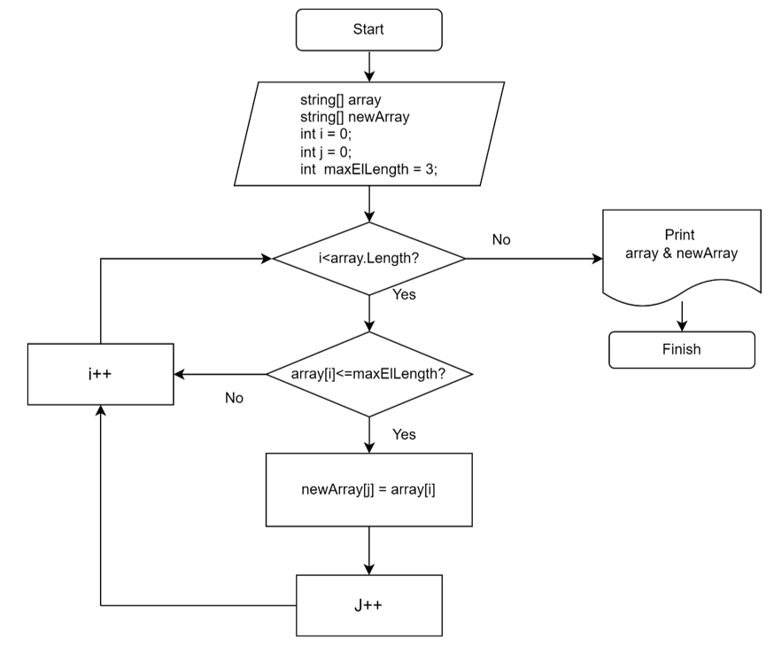

# Итоговая проверочная работа
## Задача
Написать программу, которая из имеющегося массива строк формирует массив из строк, длина которых меньше либо равна 3 символа. Первоначальных массив можно ввести с клавиатуры, либо задать на старте выполнения алгоритма. При решении не рекомендуется пользоваться коллекциями, лучше обойтись исключительно массивами. 

**Примеры** 
[“hello”, “2”, “world”, “:-)”] -> [“2”, “:-)”]
[“1234”, “1567”, “-2”, “computer science”] -> [“-2”]
[“Russia”, “Denmark”, “Kazan”] -> []

## Алгоритм решения задачи
1.	Сформировать исходный массив на основе данных, введенных пользователем.
2.	Ислледовать полученный массив и определить количество элементов, имеющих не более 3 символов. 
3.  Инициализировать новый массив.
4.  Заполнить новый массив элементами исходного массива, которые содержат не более трех символов. 
5.	Вывести на печать исходный и новый массивы. 

## Блок-схема метода формирования нового массива

## Программа
Для запуска программы необходимо использовать команду **dotnet run**

Указать количество строк (элементов массива).

Получив запрос: "Введите количество строк (элементов массива)", укажите соответствующую цифру. 

Получив запросы программы, ввести строки.

В дальнейшем программа определит, какие из введенных строк содержат в себе не более трех символов, и выведет на печать соответствующую информацию.
